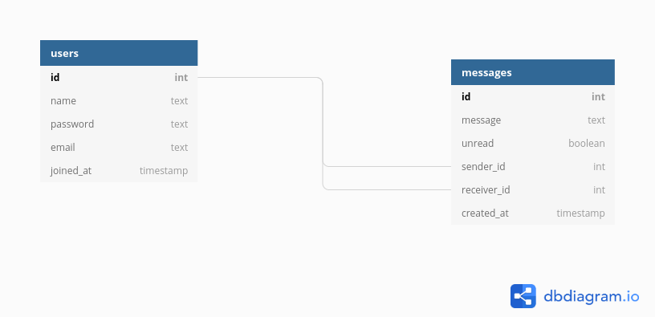

### Backend

[](https://travis-ci.com/knowbee/c-be) [](https://codeclimate.com/github/knowbee/c-be/maintainability) [](https://codeclimate.com/github/knowbee/c-be/test_coverage)

## LINKS

- [API DOCUMENTATION](https://documenter.getpostman.com/view/5349992/TWDdkZge)
- [API URL](https://ossix-backend.herokuapp.com)

## Database schema



## Getting Started

These instructions will get you a copy of the project up and running on your local machine for development and testing purposes.

### Prerequisites

Here are the environment prerequisites for the server

```
- NodeJS
- Docker
```

### Installing

- Clone the repository `https://github.com/knowbee/c-be`
- Run `yarn` to install node packages
- Create `.env` using .env-sample as a guide
- Run `yarn run dev` to start up the server

## Docker Setup

- Install Docker
- Run `docker-compose up`

## Running the tests

- Run `yarn run test`

## Endpoints

| Resource URL   | Method | Description                             |
| -------------- | ------ | --------------------------------------- |
| /auth/register | POST   | Register a new user                     |
| /auth/login    | POST   | Login user                              |
| /users         | GET    | GET all users                           |
| /messages      | POST   | Send a message                          |
| /messages      | GET    | GET all messages from a one to one chat |

### Authentication:

`POST /auth/login`

Example request body:

```source-json
{
    "email": "alice@gmail.com",
    "password": "alicealice"
}
```

Required fields: `email`, `password`

### Registration:

`POST /auth/register`

Example request body:

```source-json
{
    "name": "Alice Walker",
    "email": "alice@gmail.com",
    "password": "alicealice"
}
```

### Get Users

Authentication required, returns list of Users

`GET /users`

### POST Messages

Authentication required, sends a new message
Accepted fields: `sender_id`, `receiver_id`, `message`

`POST /messages`

### GET Messages

Authentication required, returns messages for user

`GET /messages`

### Author

Igwaneza Bruce
