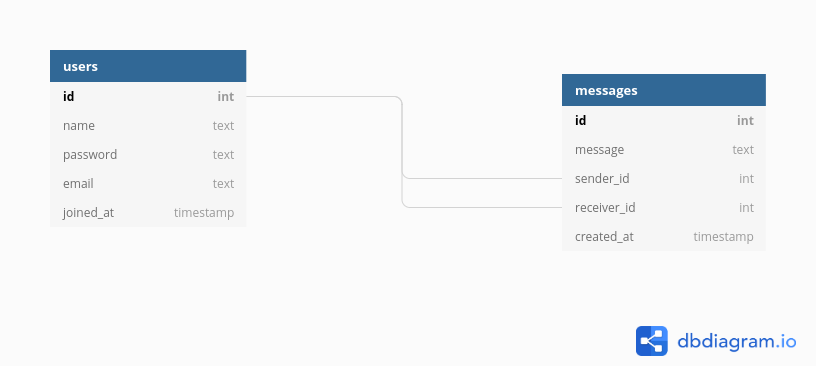

### c-be

  

## Database schema

## Getting started

## Endpoints

| Resource URL   | Method | Description                             |
| -------------- | ------ | --------------------------------------- |
| /auth/register | POST   | Register a new user                     |
| /auth/login    | POST   | Login user                              |
| /users         | GET    | GET all users                           |
| /messages      | POST   | Send a message                          |
| /messages      | GET    | GET all messages from a one to one chat |
